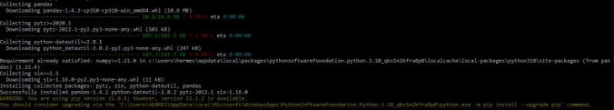
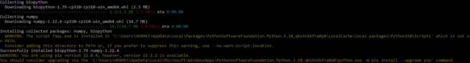
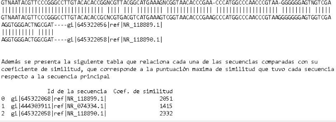

# Alineamiento de secuencias RNA y DNA, con  el algoritmo Smith–Waterman.

### Descripción
El programa adjunto a este archivo compara las secuencias de RNA o DNA, que se suministren por medio de un archivo en formato fasta, para encontrar similitudes locales entre la primera secuencia presente en el archivo y las demás. Los resultados de este análisis se alojarán en un archivo tipo texto, que indicará la secuencia que mayor similitud tiene con la primera, además del alineamiento entre las mencionadas y un coeficiente resultante del algoritmo Smith Waterman que ayuda a determinar la similitud local de cada una de las secuencias comparadas.

### Instalación
Para utilizar el programa, debe tener ya instalado python en su ordenador, descargar el código fuente llamado Alineamiento_Smith-waterman.py,  e instalar las librerías biopython y pandas. para esto último, escriba en la terminal los siguientes comandos:
- pip install pandas
- pip install biopython

a lo que debe aparecer en pantalla los siguientes resultados:

### Instrucciones de uso
Para hacer uso del programa de alineamiento local, anteriormente debe haber hecho la instalación de las librerías necesarias para el funcionamiento del programa y tener las secuencias que desea analizar en un archivo en formato fasta. Es importante que coloque en primer lugar del archivo la secuencia con la que desea comparar las demás.

A continuación, entre a la carpeta donde se encuentra alojado el código que descargó previamente por medio de la terminal de su pc. Se recomienda que el archivo en el que se encuentran sus secuencias esté en la misma carpeta que el código fuente del programa. Ahora escriba la siguiente línea de código:

	python Alineamiento_Smith-waterman.py secuencias.fasta

donde secuencias.fasta es el archivo en el que se encuentran las secuencias a analizar, en caso de que este archivo tenga una ubicación distinta a la del código del programa, incluya la ruta de la ubicación del archivo, a continuación puede ver un ejemplo.

Con esto solo resta esperar a que el programa termine de ejecutarse, cuando esto pase, ya podrá ver los resultados del alineamiento en un archivo tipo texto que se guardará en la misma carpeta en la que se encuentra el código que ejecutó. de este estilo debe verse el resultado: 

